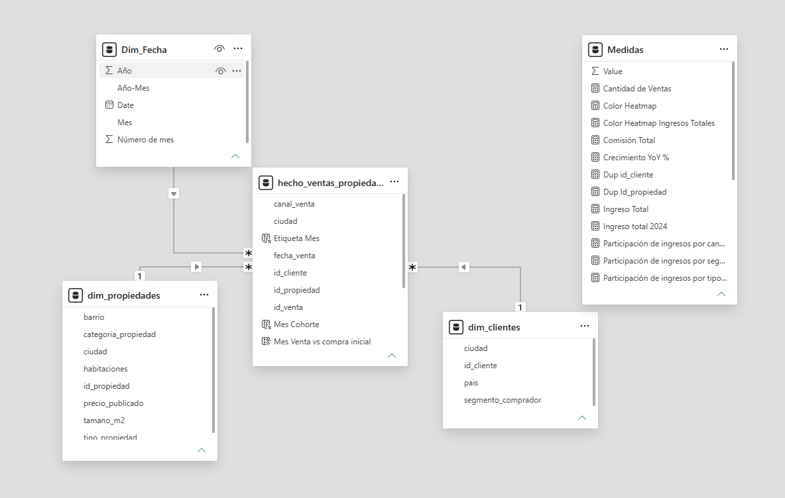
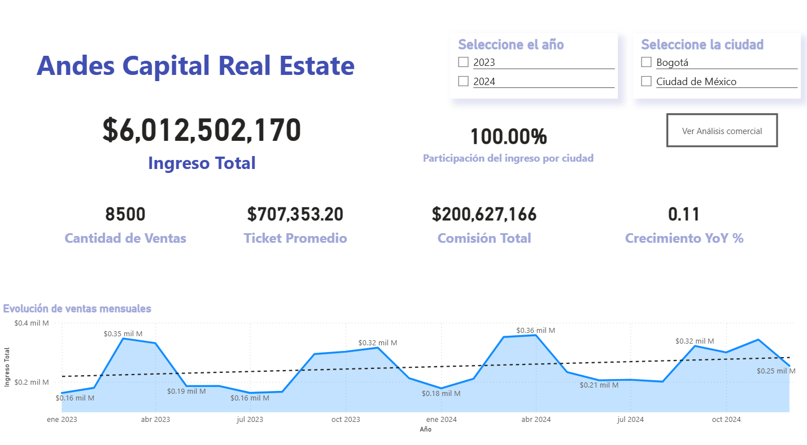
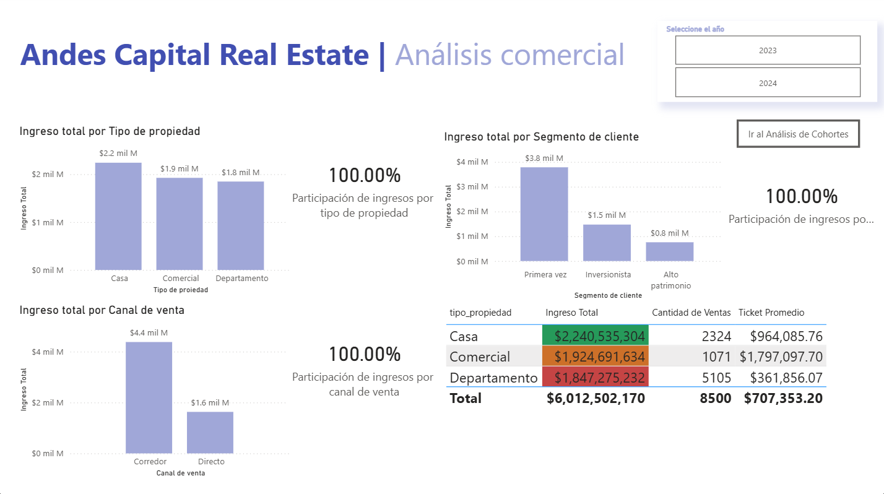
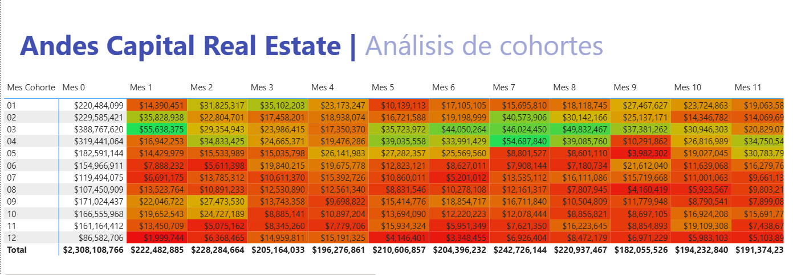
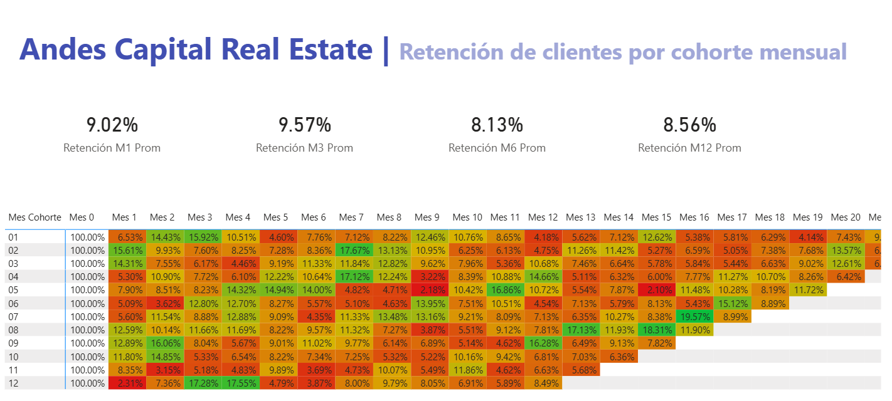

# 🏘️ Andes Capital Real Estate: Commercial Intelligence & Cohort Analysis Dashboard

This project presents an **interactive Power BI dashboard** developed for **Andes Capital Real Estate**, focused on understanding commercial performance, customer behavior, and retention patterns in the real estate business.

The dashboard combines **executive KPI monitoring, commercial analysis, time intelligence, cohort analysis, and customer retention metrics** to support strategic decision-making.

The project integrates a **star schema data model**, DAX measures, and interactive dashboards to transform transactional data into actionable business insights.

---

## 📌 Business Objective

The company needed a centralized analytical view to answer key business questions such as:

- What is the total revenue generated from property sales?
- Which property types generate the highest revenue?
- Which customer segments contribute the most?
- How do sales evolve over time?
- Is the business growing year over year?
- Do customers purchase again after their first transaction?

The objective was to create an executive and analytical dashboard capable of supporting **commercial and customer retention decisions**.

---

## 🛠 Tools & Technologies

- Power BI
- DAX
- Power Query
- Data Modeling
- Time Intelligence
- Cohort Analysis
- Data Visualization
- Business Intelligence

---

## 🔍 Dashboard Structure

### 1. Executive Overview

The first dashboard page was designed to provide a quick executive understanding of business performance.

It includes:

- total revenue
- total sales volume
- average ticket size
- total commission generated
- Year-over-Year (YoY) growth
- monthly sales evolution
- dynamic filtering by year and city

The objective was to provide business leaders with a high-level overview in just a few seconds.

---

### 2. Commercial Analysis

A second dashboard page was designed to analyze commercial performance in greater depth.

The analysis includes:

- property type performance
- customer segment contribution
- sales channel comparison
- average ticket analysis
- sales distribution

This dashboard helps identify commercial opportunities and performance differences across segments.

---

### 3. Cohort Analysis

A cohort dashboard was developed to answer:

> **Do customers return after their first purchase?**

Monthly cohort matrices were created to analyze:

- repeat purchase behavior
- revenue contribution over time
- customer recurrence patterns
- cohort performance

---

### 4. Customer Retention

A dedicated customer retention dashboard was built using heatmaps and aggregated KPIs.

Key retention metrics include:

- **M1 Retention**
- **M3 Retention**
- **M6 Retention**
- **M12 Retention**

This view helps identify customer loyalty and long-term retention trends.

---

## ⭐ Data Model

The project was built using a **star schema model**, including:

- fact sales table
- customer dimension
- property dimension
- calendar table (`dim_fecha`)
- DAX measures table

This structure enabled efficient time intelligence calculations and scalable analytical exploration.

---

## 📊 Dashboard Preview

### Executive Overview

Executive dashboard designed to monitor KPIs, sales evolution, and commercial growth trends.

---

### Commercial Analysis

Dashboard focused on analyzing property types, customer segments, and commercial channel performance.

---

### Cohort Analysis

Cohort matrix used to analyze repeat purchase behavior and revenue evolution over time.

---

### Customer Retention

Heatmap dashboard used to monitor customer retention patterns across multiple time horizons.

---

## 📈 Key Findings

- The business generated more than **$6 billion in total revenue**, supported by over **8,500 property sales**.
- The **First-Time Buyer segment** represented the highest revenue contribution.
- **House properties generated the highest total revenue**.
- The **Broker sales channel** concentrated the majority of business income.
- Cohort analysis revealed differentiated customer repurchase behavior.
- Retention metrics suggest opportunities to strengthen long-term customer loyalty.

---

## 💡 Business Recommendations

The analysis suggests opportunities to:

- strengthen customer retention strategies
- optimize commercial channels
- personalize strategies by buyer segment
- prioritize high-performing property categories
- monitor cohort performance to detect retention changes

---

## 🎯 Key Skills Demonstrated

- Power BI Dashboard Development
- Business Intelligence
- Star Schema Data Modeling
- DAX Measures
- Time Intelligence
- Cohort Analysis
- Customer Retention Analysis
- Executive Reporting
- Data Visualization

---

## 📁 Files Included

- Power BI dashboard (`.pbix`)
- Dashboard screenshots
- Data model
- Project documentation

---

## 🔗 Portfolio

- Notion Portfolio: https://www.notion.so/Andes-Capital-Real-Estate-Commercial-Intelligence-Cohort-Analysis-Dashboard-36dddeb97846805ebf5bd7b1abada6fb?source=copy_link
